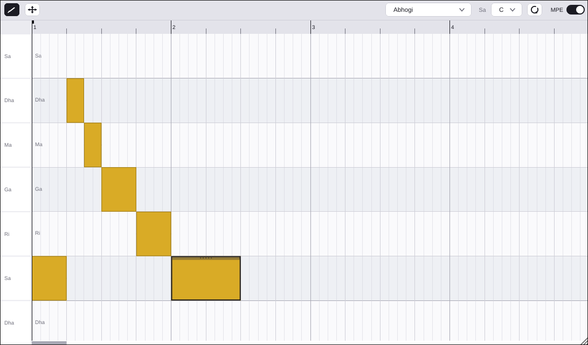

# MIDI2Svara



This plugin synthesizes Gamakas from plain Musical Instrument Digital Interface (MIDI) notes


## Setup

```bash
git clone --recurse-submodules https://github.com/vivekvjyn/MIDI2Svara.git
cd MIDI2Svara
cmake -B build -G Ninja -DCMAKE_BUILD_TYPE=Release
cmake --build build
```
